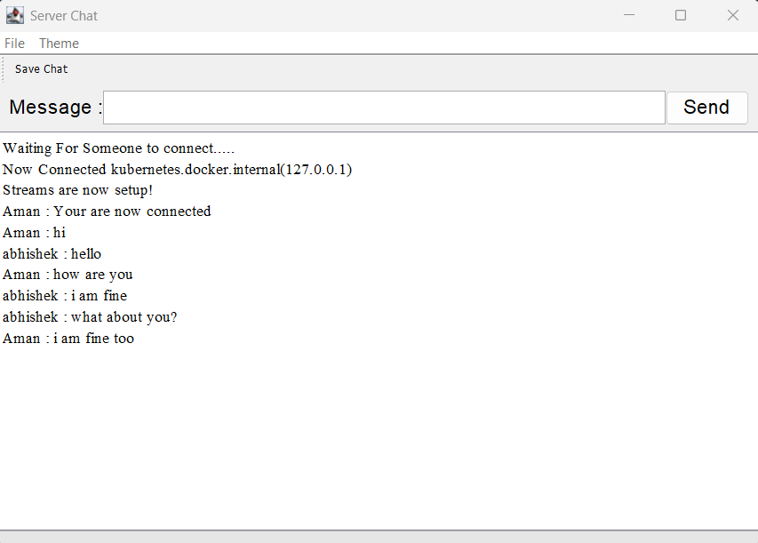
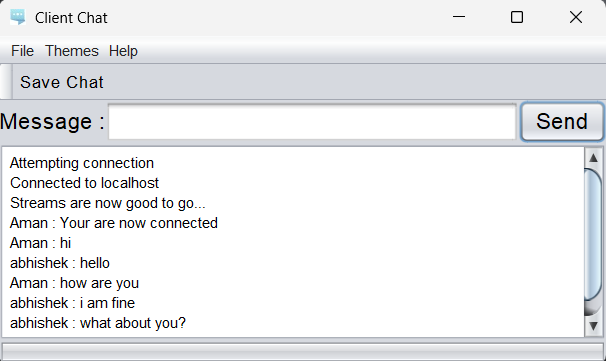
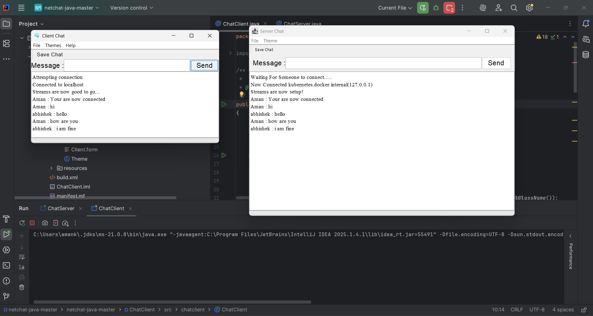

# NetChat
A simple **Client–Server Chat Application** built using **Java Sockets** and **Swing GUI**.  
This project demonstrates real-time messaging between two or more systems over a network.

---

## 🚀 Features
- Real-time two-way chatting  
- Swing-based GUI  
- Server waits for client connection  
- Works on **localhost** and **multiple systems (LAN / Wi-Fi)**  
- Chat saving option  

---

## 🖼️ Screenshots

### Server Chat Window


### Client Chat Window


### Both Running Together


---

## 🧠 How This Works

### Server (ChatServer.java)
- Creates **ServerSocket** on a fixed port  
- Accepts client connection  
- Sets up **Input/Output Streams**  
- Listens and sends messages continuously  

### Client (ChatClient.java)
- Connects to the server using:
  - Server IP  
  - Port  
  - User Name  
- Sends and receives messages  
- Displays chats in GUI  

---

## 🖧 How Two Systems Can Chat?

### 1️⃣ Find IPv4 Address of Server System  
Open CMD and run:

```cmd
ipconfig
```

Copy the **IPv4 Address** (e.g., `192.168.1.10`).

---

### 2️⃣ Run Server  
Start `ChatServer.java` on **System A**.

It will run on:

```
Server IP: System A's IPv4 (e.g., 192.168.1.10)
Port: 1234
```

---

### 3️⃣ Run Client  
Start `ChatClient.java` on **System B** and enter:

```
Name: yourName
Server IP: 192.168.1.10
Port: 1234
```

Click **Connect** → Chat begins.

✔️ Both systems must be on the **same Wi-Fi / LAN network**.

---

## 🛠️ Steps to Run the Project

### Clone the Repository
```bash
git clone https://github.com/your-username/netchat-java.git
cd netchat-java
```

### Run the Server
```
src/server/ChatServer.java
```

### Run the Client
```
src/client/ChatClient.java
```

---

## 📂 Folder Structure
```
netchat-java/
│── src/
│   ├── client/
│   │   └── ChatClient.java
│   ├── server/
│   │   └── ChatServer.java
│── resources/
│── Client.form
│── build.xml
│── manifest.mf
│── README.md
│── images/
│       ├── server.png
│       ├── client.png
│       └── both.png
```

---

## 📌 Technologies Used
- Java 8+  
- Java Networking (Socket, ServerSocket)  
- Swing GUI  

---

## 🤝 Contributing
Pull requests are welcome.
